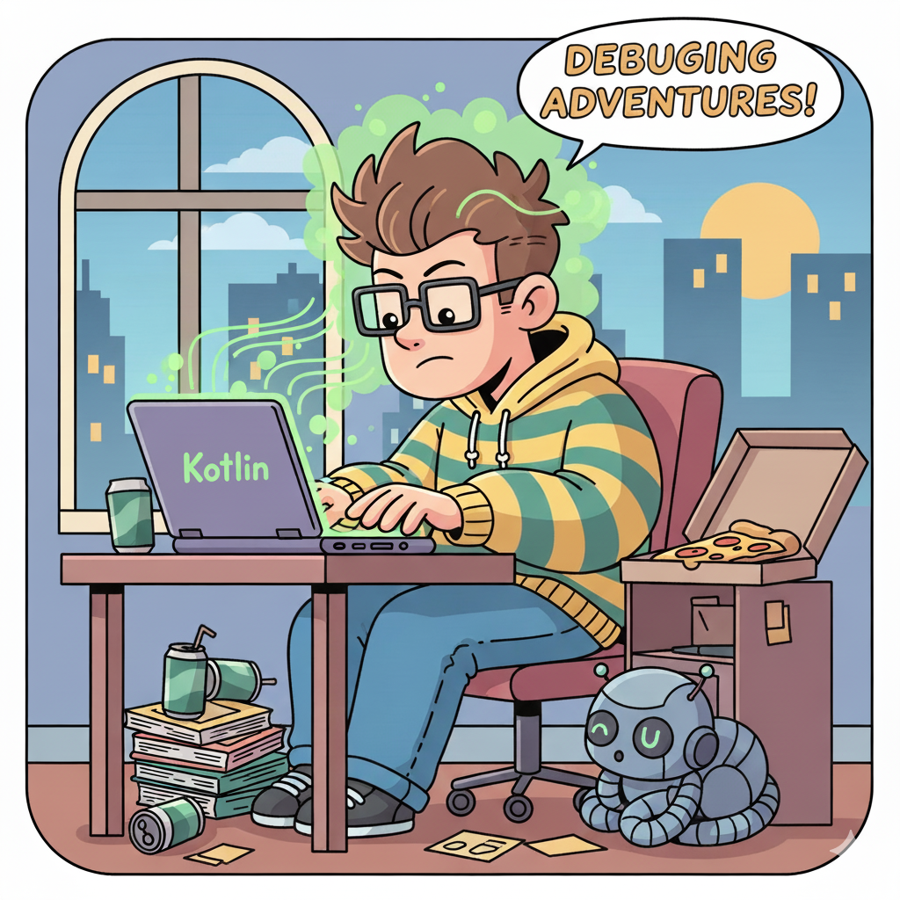
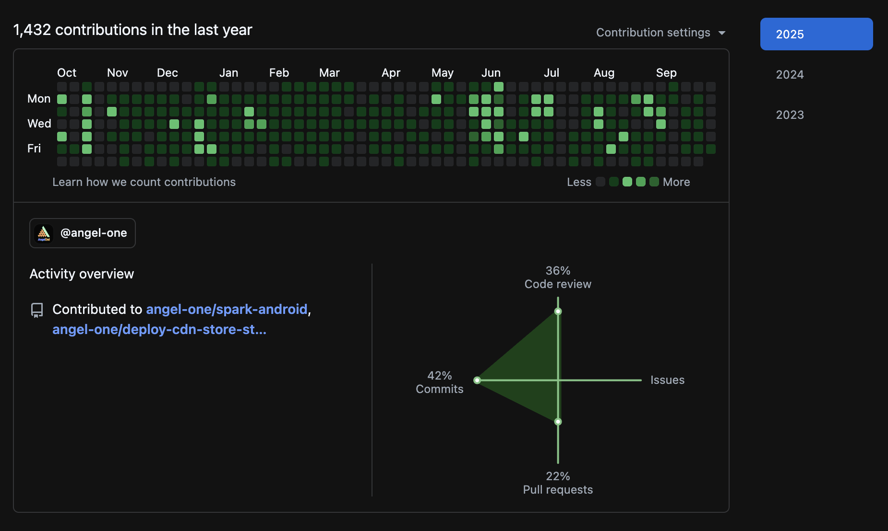
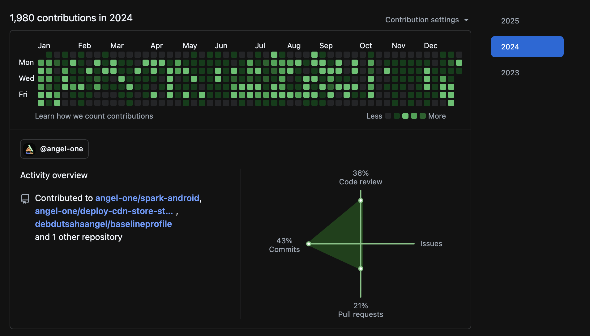
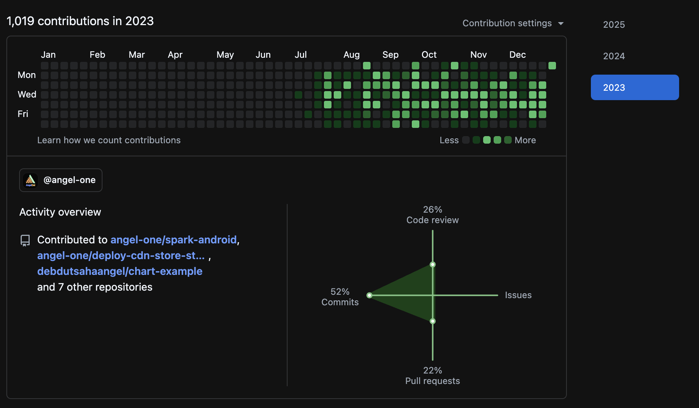

<div align="center">
  
</div>

<div align="center">
  <a href="https://git.io/typing-svg">
    
  </a>
</div>

<br/>

<div align="center">
  <a href="https://www.linkedin.com/in/debdut-saha-6973a4169/">
    
  </a>&nbsp;
  <a href="https://medium.com/@debdut.saha.1">
    
  </a>&nbsp;
  <a href="https://stackoverflow.com/users/10910383/debdut-saha">
    
  </a>&nbsp;
  <a href="mailto:debdut.saha.1@gmail.com">
    
  </a>&nbsp;
  <a href="https://www.youtube.com/@debdutsaha4316">
    
  </a>&nbsp;
  <a href="https://www.instagram.com/debdut_saha8583">
    
  </a>
</div>

<div align="center">
  <br/>
  
</div>

<br/>

---



## About Me

> **Mobile engineer by craft. Backend builder by curiosity.**

I'm a **Senior Android Engineer (SDE-3)** at **AngelOne** with **5+ years** of experience shipping mobile products used by millions. From server-driven UI revamps to building animation libraries in Jetpack Compose and publishing SDKs to **Maven Central** — I've gone deep on the mobile side.

But I believe the best mobile engineers understand what happens *behind the API*.

I'm now actively building backend systems — **CDC pipelines in Go**, **real-time messaging servers**, and **auth services** — because I want to own the entire journey from pixel to database.

- :telescope: Currently building **[koml](https://github.com/12345debdut/koml)** — on-device LLM inference for Kotlin Multiplatform
- :seedling: Deepening my skills in **Go**, **PostgreSQL internals** & **distributed systems**
- :package: Published libraries on **Maven Central** and **GitHub Packages**
- :office: Previously at **Sharechat** (SDE-2) and **TCS** (System Engineer)
- :round_pushpin: Based in **Kolkata, India**

<br clear="both" />

---

## :package: Open-Source Libraries I've Built

<table>
<tr>
<td width="50%">

### :robot: [koml](https://github.com/12345debdut/koml)
**On-device LLM inference for Kotlin Multiplatform**

A thin, idiomatic wrapper over llama.cpp with Flow-based streaming across Android, iOS, JVM, and native. Download models from HuggingFace, run inference entirely offline.


`v0.0.5` · `5 releases` · `Apache 2.0`

</td>
<td width="50%">

### :anchor: [anchor-di](https://github.com/12345debdut/anchor-di)
**KMP Dependency Injection — inspired by Hilt**

Compile-time code generation via KSP. Constructor injection, singletons, scoped components, ViewModel injection in Compose Multiplatform — all from `commonMain`, zero reflection.


`v1.0.0` · `91 commits` · `1 ⭐` · `Apache 2.0`

</td>
</tr>
<tr>
<td width="50%">

### :musical_score: [composer](https://github.com/12345debdut/composer)
**Unidirectional State Management SDK for Android**

Store-based architecture with reactive Kotlin Flow updates, Jetpack Compose support, and multi-widget composition. **Published to Maven Central.**


`v1.0.0` · `34 commits` · `Published on Maven Central`

</td>
<td width="50%">

### :black_joker: [Card-Stack-Animation-Compose](https://github.com/12345debdut/Card-Stack-Animation-Compose)
**Swipeable Card Stack in Jetpack Compose**

A gesture-driven card stack animation library built entirely in Jetpack Compose. Smooth swipe-to-dismiss with spring physics and customizable stack depth.


`2 ⭐` · `1 fork` · `16 commits`

</td>
</tr>
</table>

---

## :arrows_counterclockwise: The Transition: Mobile :arrow_right: Backend

<table>
<tr>
<td width="50%" valign="top">

### :iphone: Mobile Mastery
*5+ years of depth*

| Area | Details |
|------|---------|
| **Android Native** | Jetpack Compose, Coroutines, Flow, Hilt, Room |
| **Kotlin Multiplatform** | Shared logic across Android, iOS, JVM, native |
| **React Native** | Offline-first with WatermelonDB, Reanimated 4 |
| **iOS** | SwiftUI, UIKit fundamentals |
| **SDK Publishing** | Maven Central, GitHub Packages, KSP plugins |
| **Architecture** | MVI, MVVM, Unidirectional Data Flow, Clean Arch |
| **Tooling** | Baseline Profiling, Server-Driven UI, KSP codegen |

</td>
<td width="50%" valign="top">

### :wrench: Backend — Actively Building
*The next chapter*

| Area | Details |
|------|---------|
| **Go** | Auth systems, CDC pipelines, config clients, SQL tooling |
| **Node.js / Fastify** | Real-time servers with Socket.IO |
| **PostgreSQL** | WAL replication, logical decoding, CDC |
| **Docker** | Containerized deployments with Compose |
| **Kafka** | Event streaming with pluggable sinks |
| **Infrastructure** | Fly.io, DigitalOcean, AWS |
| **API Design** | REST + Swagger documentation |

</td>
</tr>
</table>

### :hammer_and_wrench: Backend Projects I've Shipped

<table>
<tr>
<td width="50%">

### :potable_water: [waltap](https://github.com/12345debdut/waltap)
**CDC Pipeline for PostgreSQL**

Taps into the Write-Ahead Log via logical replication and delivers row-level changes to pluggable sinks (stdout, webhook, Kafka). Includes a read/write split TCP proxy.


`v1.0.0` · `MIT License`

</td>
<td width="50%">

### :speech_balloon: [realtime-chat](https://github.com/12345debdut/realtime-chat)
**Production-Grade Messaging App**

Offline-first sync, worklet animations, type-safe client-server contracts. Monorepo architecture with shared packages.


`v1.0.0` · `Apache 2.0`

</td>
</tr>
</table>

---

## :hammer_and_wrench: Tech Stack

<div align="center">

### Languages


### Mobile & Frontend


### Backend & Infrastructure


### Databases


### Tools & DevOps


</div>

---

## :briefcase: Professional Journey

```
  AngelOne (SDE-3)              Sharechat (SDE-2)           TCS (System Engineer)
  ==================            =================           =====================
  Home page revamp              Tournament Battle           EDGE-365 Retail KPIs
  (Flutter -> Native SDUI)      Super Gifting               RecyclerView form engine
  Order Pad revamp              Gifting Experience           Dashboard implementation
  Validation Engine             Compose migration            SQLDelight -> Room
  Template Engine               from XML                     migration
  Remote Config Provider
  Baseline Profiling
```

---

## :bar_chart: GitHub Stats

<div align="center">
  
  &nbsp;&nbsp;
  
</div>

<br/>

<div align="center">
  
</div>

<br/>

<div align="center">
  
</div>

---

## :snake: Contribution Snake

<div align="center">
  <picture>
    <source media="(prefers-color-scheme: dark)" srcset="https://raw.githubusercontent.com/12345debdut/12345debdut/output/github-snake-dark.svg" />
    <source media="(prefers-color-scheme: light)" srcset="https://raw.githubusercontent.com/12345debdut/12345debdut/output/github-snake.svg" />
    
  </picture>
</div>

---

## :office: Organisation Contributions

<details>
<summary><strong>AngelOne — 4,400+ contributions across 3 years (click to expand)</strong></summary>
<br/>

**2025** — 1,432 contributions
<div align="center">
  
</div>

<br/>

**2024** — 1,980 contributions
<div align="center">
  
</div>

<br/>

**2023** — 1,019 contributions
<div align="center">
  
</div>

</details>

---

<div align="center">

### :handshake: Let's Connect

**I'm always happy to chat about Android architecture, Kotlin Multiplatform, open-source libraries, or the mobile-to-backend transition. Feel free to reach out!**

<a href="https://www.linkedin.com/in/debdut-saha-6973a4169/">
  
</a>

</div>

<div align="center">
  
</div>
